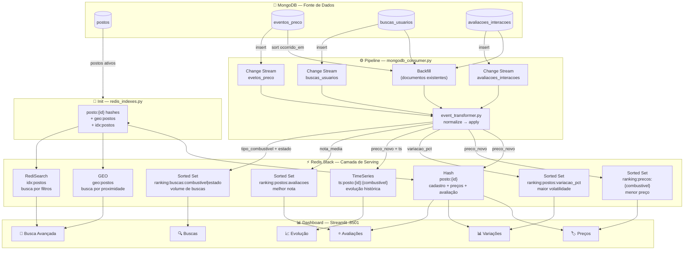

# Radar Combustível — Pipeline MongoDB → Redis

Pipeline de dados em tempo quase real que captura eventos operacionais da plataforma **Radar Combustível**, os processa e os disponibiliza em uma camada de serving rápida no **Redis**, com visualização via **Streamlit**.

---

## Sumário

1. [Contexto](#contexto)
2. [Arquitetura](#arquitetura)
3. [Estrutura do repositório](#estrutura-do-repositório)
4. [Estruturas Redis](#estruturas-redis)
5. [Fluxo do pipeline](#fluxo-do-pipeline)
6. [Pré-requisitos](#pré-requisitos)
7. [Execução via Docker Compose](#execução-via-docker-compose)
8. [Execução local (venv)](#execução-local-venv)
9. [Dashboard](#dashboard)
10. [Variáveis de ambiente](#variáveis-de-ambiente)

---

## Contexto

A plataforma **Radar Combustível** agrega informações de postos de gasolina no Brasil: preços por combustível, localização geográfica, avaliações de usuários e volume de buscas. O objetivo deste projeto é transformar esses dados em uma camada de consulta rápida capaz de responder perguntas como:

- Quais postos têm o **menor preço** de gasolina comum na minha região?
- Quais postos tiveram a **maior variação de preço** recentemente?
- Quais **bairros e estados** concentram mais buscas?
- Quais postos são os **mais bem avaliados**?
- Como o preço de um combustível **evoluiu ao longo do tempo** em um determinado posto?

---

## Arquitetura



### Serviços Docker

| Serviço         | Imagem                        | Porta(s)       | Responsabilidade                              |
|-----------------|-------------------------------|----------------|-----------------------------------------------|
| `mongo`         | `mongo:7`                     | 27017          | Banco de dados principal (replica set rs0)    |
| `mongo-init`    | `mongo:7`                     | —              | Inicializa o replica set (one-shot)           |
| `redis`         | `redis/redis-stack-server`    | 6379, 8001     | Camada de serving (Search + TimeSeries + GEO) |
| `seed`          | `python:3.11-slim`            | —              | Popula MongoDB + inicializa Redis (one-shot)  |
| `pipeline`      | `python:3.11-slim`            | —              | Backfill + change streams em tempo real       |
| `dashboard`     | `python:3.11-slim`            | 8501           | Interface Streamlit                           |

---

## Estrutura do repositório

```
radar-combustivel-pipeline/
│
├── init/
│   ├── mongo_seed.py        # Gera e insere dados fake no MongoDB
│   └── redis_indexes.py     # Cria hashes posto:{id}, geo:postos e idx:postos
│
├── pipeline/
│   ├── event_transformer.py # Normaliza documentos MongoDB em eventos tipados
│   └── mongodb_consumer.py  # Backfill + 3 change streams (threads paralelas)
│
├── queries/
│   └── redis_reader.py      # CLI demonstrativa — exibe rankings e consultas
│
├── dashboard/
│   └── app.py               # Dashboard Streamlit com 6 abas
│
├── docs/
│   └── Trabalho-final-IMDB.pdf   # Especificação do trabalho
│
├── docker-compose.yml
├── requirements.txt
├── .env.example
└── README.md
```

---

## Estruturas Redis

A escolha das estruturas foi orientada pelo tipo de consulta que cada dado precisa servir.

### `posto:{id}` — Hash

Cadastro resumido de cada posto, atualizado a cada evento de preço ou avaliação.

```
posto:6823a1b2c3d4e5f6a7b8c9d0
  nome_fantasia      "Posto Shell Centro"
  bandeira           "Shell"
  estado             "SP"
  cidade             "São Paulo"
  bairro             "Pinheiros"
  location           "-46.6833,-23.5505"    ← formato "lng,lat"
  ativo              "1"
  preco_gasolina_comum    "5.479"
  preco_etanol            "4.199"
  preco_diesel_s10        "6.189"
  nota_media         "4.32"
  rating_count       "17"
  atualizado_em      "1714255200000"
```

**Por que Hash?** Acesso O(1) por campo; leitura parcial de campos específicos (ex.: só o preço de um combustível). Compatível com o índice RediSearch.

---

### `ranking:precos:{combustivel}` — Sorted Set

Score = preço atual (R$/L). Member = posto_id.  
`ZRANGE ... WITHSCORES` retorna os postos com **menor preço** primeiro.

```
ranking:precos:gasolina_comum
  6823...d0  →  4.502
  7f1a...3c  →  4.509
  ...
```

**Por que Sorted Set?** Ranking em O(log N) de inserção; consulta do top-N em O(log N + N).

---

### `ranking:postos:variacao_pct` — Sorted Set

Score = |variação percentual| do último evento de preço. Identifica os postos com maior oscilação recente.

---

### `ranking:postos:avaliacoes` — Sorted Set

Score = nota média calculada de forma incremental (`rating_sum / rating_count`). Ranking de postos mais bem avaliados.

---

### `ranking:buscas:combustivel` e `ranking:buscas:estado` — Sorted Sets

Score = contagem acumulada de buscas. Alimentado pelo `buscas_usuarios`. Permite identificar tendências de demanda por tipo de combustível e por estado.

---

### `geo:postos` — GEO

Posições geográficas de todos os postos. Permite consultas do tipo:

```
GEOSEARCH geo:postos FROMLONLAT -46.63 -23.55 BYRADIUS 10 KM ASC COUNT 5
```

**Por que GEO?** Índice espaço-espacial nativo do Redis; busca por raio em O(N+log M).

---

### `ts:posto:{id}:{combustivel}` — TimeSeries

Uma série por combinação (posto, combustível). Cada inserção em `eventos_preco` adiciona um ponto.

```
ts:posto:6823...d0:gasolina_comum
  1714255200000  →  5.479
  1714341600000  →  5.459
  ...
```

Labels indexadas: `posto_id`, `combustivel` — permite `TS.MRANGE` com filtro para agregar a evolução média de um combustível em todos os postos.

**Por que TimeSeries?** Compressão nativa de séries temporais; aggregation (`avg`, `sum`, `min`, `max`) via `TS.RANGE` / `TS.MRANGE`; retenção configurável.

---

### `idx:postos` — RediSearch

Índice full-text e numérico sobre os hashes `posto:*`.

| Campo                   | Tipo      | Uso                                    |
|-------------------------|-----------|----------------------------------------|
| `nome_fantasia`         | Text      | Busca textual (peso 2×)                |
| `bandeira`              | Tag       | Filtro exato por bandeira              |
| `estado`                | Tag       | Filtro por UF                          |
| `cidade`                | Tag       | Filtro por cidade                      |
| `nota_media`            | Numeric   | Filtro e ordenação por nota            |
| `preco_gasolina_comum`  | Numeric   | Filtro por faixa de preço              |
| `preco_etanol`          | Numeric   | Filtro por faixa de preço              |
| `preco_diesel_s10`      | Numeric   | Filtro por faixa de preço              |
| `location`              | Geo       | Busca por proximidade via RediSearch   |

**Por que RediSearch?** Combina filtros de tag, range numérico e geoespacial em uma única query; resultado ordenável por qualquer campo numérico.

---

## Fluxo do pipeline

```
1. mongo_seed.py
   └─ insere ~10.000 documentos em cada uma das 5 coleções MongoDB

2. redis_indexes.py
   └─ lê postos ativos do MongoDB
   └─ cria hashes posto:{id} com campos zerados
   └─ adiciona a geo:postos
   └─ cria índice RediSearch idx:postos

3. mongodb_consumer.py (backfill)
   ├─ eventos_preco    → atualiza preco_{comb} no hash, sorted sets de preço
   │                      e variação, time series ts:posto:{id}:{comb}
   ├─ avaliacoes_interacoes (tipo=avaliacao)
   │                  → incrementa rating_sum/count, recalcula nota_media,
   │                      atualiza ranking:postos:avaliacoes
   └─ buscas_usuarios → ZINCRBY em ranking:buscas:combustivel e :estado

4. mongodb_consumer.py (change stream — 3 threads)
   └─ repete as mesmas transformações do backfill para qualquer
      novo documento inserido nas 3 coleções, em tempo real
```

### Decisão de modelagem orientada a acesso

Cada estrutura Redis é desenhada para uma consulta específica:

| Pergunta de negócio                          | Estrutura Redis utilizada          |
|----------------------------------------------|------------------------------------|
| Menor preço de gasolina na região            | `ZRANGE ranking:precos:gasolina_comum 0 9` |
| Postos com maior volatilidade de preço       | `ZREVRANGE ranking:postos:variacao_pct 0 9` |
| Postos mais bem avaliados                    | `ZREVRANGE ranking:postos:avaliacoes 0 9` |
| Combustível mais buscado                     | `ZREVRANGE ranking:buscas:combustivel 0 5` |
| Postos a menos de 10 km de mim              | `GEOSEARCH geo:postos ... BYRADIUS 10 KM` |
| Postos Shell em SP com nota ≥ 4             | `FT.SEARCH idx:postos "@estado:{SP} @bandeira:{Shell}"` |
| Evolução do preço de etanol no posto X       | `TS.RANGE ts:posto:{id}:etanol - +` |
| Tendência média diária de preço por combustível | `TS.MRANGE ... AGGREGATION avg 86400000 FILTER combustivel=etanol` |

---

## Pré-requisitos

- **Docker** ≥ 24 e **Docker Compose** ≥ 2.20
- **Python** ≥ 3.9 (somente para execução local)

---

## Execução via Docker Compose

O fluxo completo — seed, pipeline e dashboard — é orquestrado pelo `docker-compose.yml`. Os serviços sobem em ordem correta automaticamente.

```bash
# 1. Suba todos os serviços
docker compose up -d

# 2. Acompanhe o seed (leva ~2 min na primeira vez)
docker compose logs -f seed

# 3. Acompanhe o pipeline (backfill + change streams)
docker compose logs -f pipeline

# 4. Abra o dashboard
open http://localhost:8501
# ou acesse: http://localhost:8001  ← Redis Insight (interface gráfica do Redis)
```

Para reiniciar o ambiente do zero (apaga os volumes):

```bash
docker compose down -v
docker compose up -d
```

---

## Execução local (venv)

Use esta forma para desenvolvimento ou para executar os scripts individualmente.

### 1. Suba apenas a infraestrutura

```bash
docker compose up -d mongo redis
docker compose up mongo-init   # inicializa o replica set (roda uma vez)
```

### 2. Crie e ative o ambiente virtual

```bash
python3 -m venv .venv
source .venv/bin/activate      # Linux / macOS
# .venv\Scripts\activate       # Windows
pip install -r requirements.txt
```

### 3. Configure as variáveis de ambiente

```bash
cp .env.example .env.local
# edite .env.local se necessário (padrões já funcionam com Docker local)
```

### 4. Execute cada etapa em ordem

```bash
# Popula o MongoDB com dados fake
python init/mongo_seed.py

# Cria as estruturas iniciais no Redis
python init/redis_indexes.py

# Processa eventos existentes (backfill) e fica ouvindo novos (change stream)
python pipeline/mongodb_consumer.py

# Em outro terminal — dashboard Streamlit
streamlit run dashboard/app.py

# Em outro terminal — consultas CLI demonstrativas
python queries/redis_reader.py --once
```

---

## Dashboard

Acesse em **http://localhost:8501** após subir o ambiente.

### Aba 🏷️ Preços
Ranking dos postos com **menor preço** para o combustível selecionado. Gráfico de barras horizontais colorido por faixa de preço + tabela detalhada com bandeira, cidade e estado.

### Aba 📊 Variações
Ranking dos postos com **maior variação percentual recente** de preço. Útil para identificar postos com comportamento instável ou que acabaram de reajustar.

### Aba ⭐ Avaliações
Top postos por **nota média** dos usuários. Exibe nota, total de avaliações, bandeira e localização.

### Aba 🔍 Buscas
Volume de buscas agregado por **combustível** (gráfico de pizza) e por **estado** (barras horizontais). Revela tendências de demanda na plataforma.

### Aba 📈 Evolução de Preços
Duas visões temporais:
- **Série individual**: insira o ID de um posto e selecione o combustível para ver todos os pontos registrados no `ts:posto:{id}:{combustivel}`.
- **Tendência agregada**: média diária de preço de todos os postos para um combustível, calculada via `TS.MRANGE … AGGREGATION avg`.

### Aba 🔎 Busca Avançada (RediSearch)
Filtragem combinada por estado, bandeira, nota mínima e preço máximo para o combustível de interesse. A consulta usa o índice `idx:postos` e retorna resultados ordenados por menor preço.

---

## Variáveis de ambiente

| Variável     | Padrão                                              | Descrição                          |
|--------------|-----------------------------------------------------|------------------------------------|
| `MONGO_URI`  | `mongodb://localhost:27017/?directConnection=true`  | URI de conexão ao MongoDB          |
| `DB_NAME`    | `radar_combustivel`                                 | Nome do banco de dados             |
| `REDIS_HOST` | `localhost`                                         | Host do Redis                      |
| `REDIS_PORT` | `6379`                                              | Porta do Redis                     |
| `N`          | `10000`                                             | Documentos por coleção no seed     |
| `BATCH_SIZE` | `2000`                                              | Tamanho do lote de inserção        |
| `SEED`       | `42`                                                | Semente do gerador de dados fake   |

No Docker Compose, as variáveis `MONGO_URI` e `REDIS_HOST` são sobrescritas para apontar para os serviços internos (`mongo` e `redis`).
