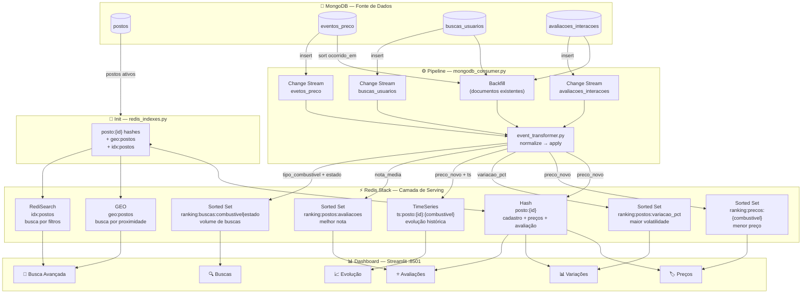
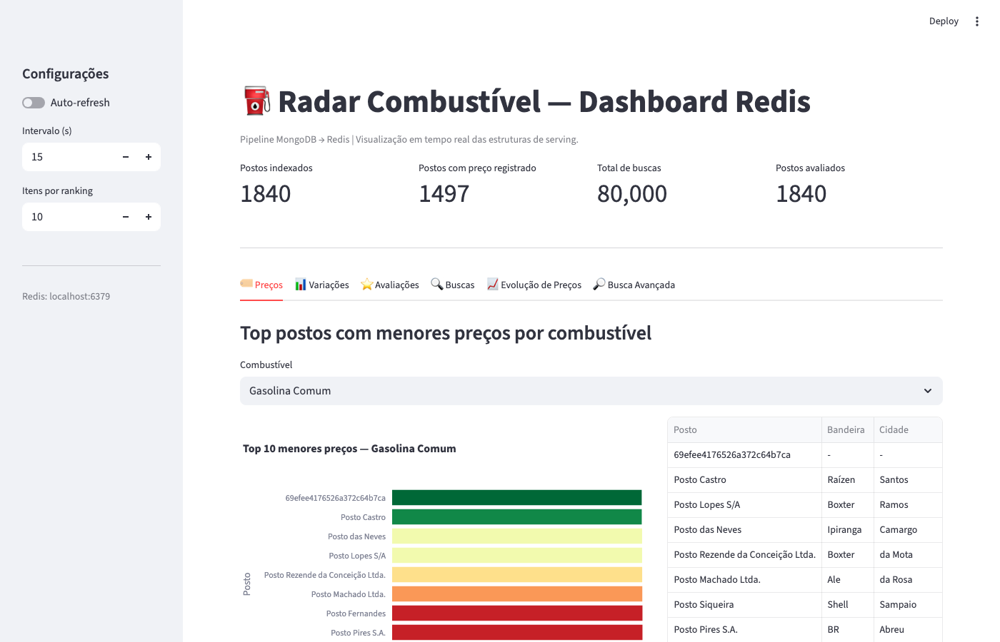
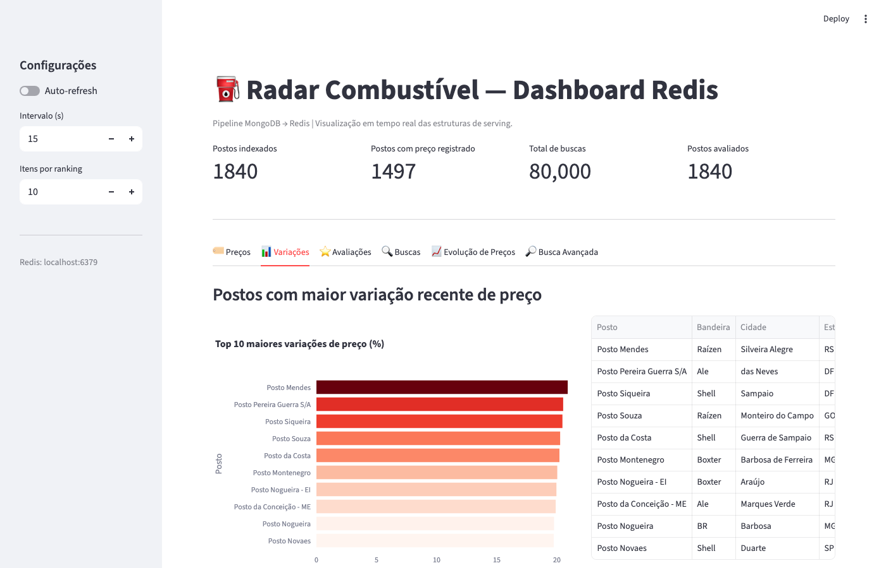
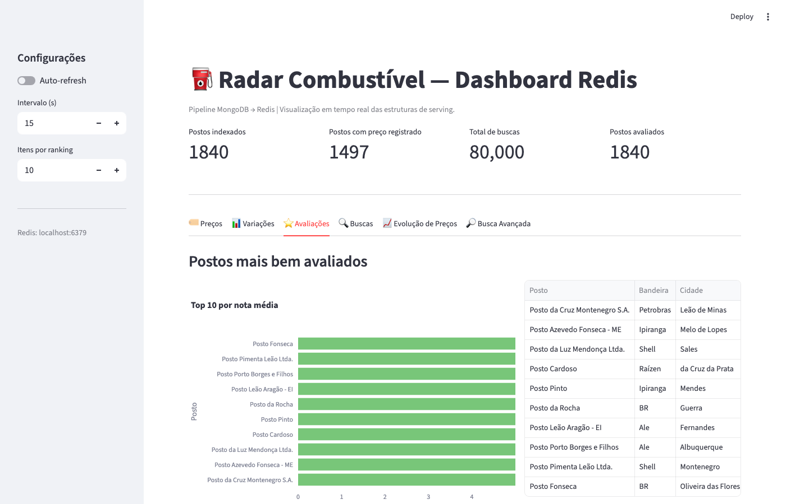
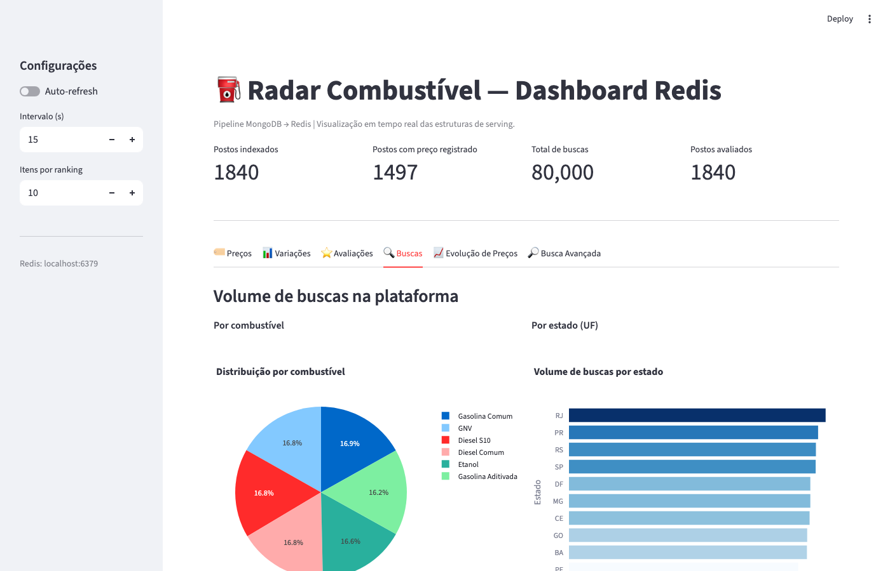
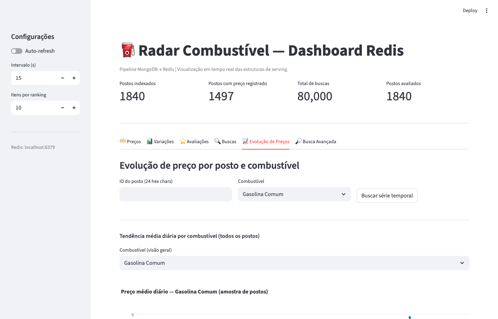
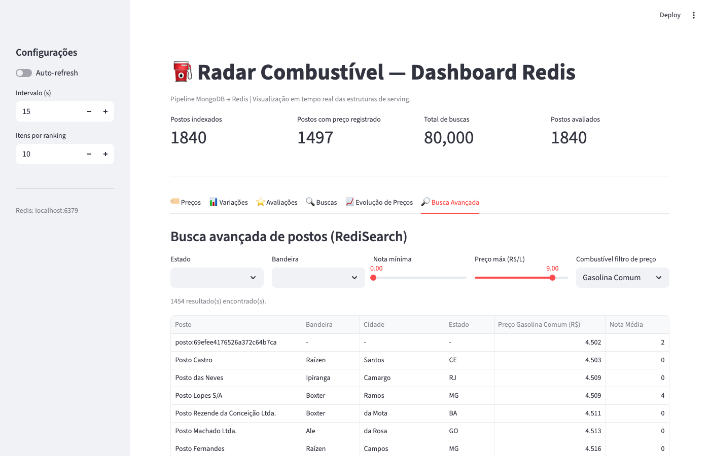

# Trabalho Final — Pipeline MongoDB → Redis
### Caso: Plataforma Radar Combustível
### Disciplina: Introdução a MongoDB e Bancos de Dados Não-Relacionais

---

## 1. Integrantes

> _Preencha com os nomes e RAs do grupo (máximo 6 integrantes)._

| Nome | RA / Matrícula |
|------|---------------|
|      |               |
|      |               |
|      |               |
|      |               |
|      |               |
|      |               |

---

## 2. Descrição do problema

### Contexto

A plataforma **Radar Combustível** agrega informações de postos de combustível no Brasil: preços por tipo de combustível, localização geográfica, avaliações de usuários e volume de buscas realizadas na plataforma.

O banco de dados operacional no MongoDB registra eventos contínuos de atualização de preço, novas avaliações e consultas de usuários. No entanto, consultas analíticas e de ranking diretamente sobre essas coleções são lentas e custosas conforme o volume cresce.

### Problema central

> **Como disponibilizar, em tempo quase real, respostas rápidas a consultas de alto valor para o negócio — como menor preço por região, postos mais bem avaliados e tendências de busca — sem sobrecarregar o banco transacional?**

### Perguntas de negócio que o sistema deve responder

| # | Pergunta | Frequência de acesso |
|---|----------|----------------------|
| 1 | Quais postos têm o **menor preço** de gasolina comum por região? | Alta — consulta central do app |
| 2 | Quais postos tiveram a **maior variação recente** de preço? | Média — alertas de usuário |
| 3 | Quais postos são os **mais bem avaliados**? | Alta — tela de descoberta |
| 4 | Quais **combustíveis e estados** concentram mais buscas? | Baixa — analytics interno |
| 5 | Há postos dentro de um **raio geográfico** da minha posição? | Alta — geolocalização |
| 6 | Como o preço de um combustível **evoluiu ao longo do tempo** num posto? | Média — histórico |

### Por que MongoDB + Redis?

- **MongoDB** é a fonte de verdade: armazena documentos ricos, suporta geoespacial nativo e serve como origem dos change streams.
- **Redis** é a camada de serving: estruturas de dados nativas (Sorted Set, Hash, GEO, TimeSeries, Search) permitem responder cada pergunta acima em complexidade O(log N) ou O(1), com latência de milissegundos.

A combinação elimina a necessidade de queries agregadas pesadas no MongoDB em tempo de leitura.

---

## 3. Descrição do caso escolhido

O recorte implementado cobre o **ciclo completo de eventos de um posto de combustível**:

1. **Cadastro** — cada posto tem localização geográfica, bandeira (Shell, Ipiranga, etc.) e endereço.
2. **Precificação** — eventos de atualização de preço registram preço anterior, preço novo e variação percentual para cada combustível (gasolina comum, aditivada, etanol, diesel S10, diesel comum, GNV).
3. **Avaliação** — usuários registram notas de 1 a 5 para postos específicos.
4. **Busca** — cada busca na plataforma registra o combustível de interesse e o estado do usuário.

As cinco coleções MongoDB do projeto mapeiam diretamente esses eventos:

| Coleção | Documentos | Papel no pipeline |
|---------|-----------|-------------------|
| `postos` | 10.000 | Fonte de cadastro para os hashes Redis |
| `eventos_preco` | 10.000 | Fonte de preços, rankings e time series |
| `avaliacoes_interacoes` | 10.000 | Fonte do ranking de avaliações |
| `buscas_usuarios` | 10.000 | Fonte dos rankings de demanda |
| `localizacoes_postos` | 10.000 | Complemento geoespacial do cadastro |

Total: **50.000 documentos** no banco de dados.

---

## 4. Arquitetura da solução

### Visão geral



### Componentes e responsabilidades

| Componente | Arquivo | Responsabilidade |
|------------|---------|-----------------|
| Gerador de dados | `init/mongo_seed.py` | Popula as 5 coleções MongoDB com dados realistas via Faker |
| Init Redis | `init/redis_indexes.py` | Cria hashes `posto:{id}`, GEO `geo:postos` e índice RediSearch |
| Transformador | `pipeline/event_transformer.py` | Normaliza documentos brutos em eventos tipados |
| Consumer | `pipeline/mongodb_consumer.py` | Backfill histórico + 3 change streams paralelos |
| Consultas CLI | `queries/redis_reader.py` | Demonstra todas as consultas Redis via terminal |
| Dashboard | `dashboard/app.py` | Interface Streamlit com 6 abas de visualização |

### Infraestrutura Docker

| Serviço | Imagem | Porta | Papel |
|---------|--------|-------|-------|
| `mongo` | `mongo:7` | 27017 | Banco principal com replica set `rs0` |
| `mongo-init` | `mongo:7` | — | Inicializa o replica set (one-shot) |
| `redis` | `redis/redis-stack-server` | 6379 / 8001 | Redis com módulos Search, TimeSeries e GEO |
| `seed` | `python:3.11-slim` | — | Seed do MongoDB + init do Redis (one-shot) |
| `pipeline` | `python:3.11-slim` | — | Consumer em execução contínua |
| `dashboard` | `python:3.11-slim` | 8501 | Interface de visualização |

> O replica set é **obrigatório** para o MongoDB Change Streams. O serviço `mongo-init` garante que `rs0` esteja ativo antes do consumer iniciar.

---

## 5. Pipeline MongoDB → Redis

### Modelagem orientada a acesso

A premissa central do pipeline é: **cada estrutura Redis é desenhada para servir exatamente uma consulta**, e não para refletir o modelo documental do MongoDB. Essa abordagem — *access-pattern-driven modeling* — elimina o custo de agregação em tempo de leitura.

### Etapa 1 — Init (redis_indexes.py)

Executado uma única vez antes do consumer. Lê a coleção `postos` e, para cada posto ativo:

1. Cria o hash `posto:{id}` com todos os campos cadastrais e preços zerados.
2. Adiciona ao índice geoespacial `geo:postos` com as coordenadas do posto.
3. Ao final, cria o índice RediSearch `idx:postos` com os prefixos `posto:`.

```
[REDIS-INIT] Populando hashes posto:{id} e geo:postos...
  500 postos carregados no Redis...
  ...
[REDIS-INIT] 9.684 postos ativos carregados.
[REDIS-INIT] idx:postos criado com sucesso.
```

### Etapa 2 — Backfill (mongodb_consumer.py)

Na inicialização, o consumer processa **todos os documentos existentes** nas três coleções de eventos, em ordem cronológica:

```
[BACKFILL] Processando eventos_preco (ordenado por ocorrido_em)...
[BACKFILL]   eventos_preco: 2000 processados...
  ...
[BACKFILL] eventos_preco: 10000 total.
[BACKFILL] Processando avaliacoes_interacoes...
[BACKFILL] avaliacoes_interacoes: 2041 avaliações processadas.
[BACKFILL] Processando buscas_usuarios...
[BACKFILL] buscas_usuarios: 10000 buscas processadas.
[BACKFILL] Concluído.
```

A ordenação cronológica em `eventos_preco` garante que o **último evento processado** seja o mais recente — ou seja, o preço gravado no hash `posto:{id}` e no sorted set é sempre o **preço atual** do posto.

### Etapa 3 — Change Streams (tempo real)

Após o backfill, três threads daemon monitoram inserções em cada coleção:

```python
streams = [
    ("eventos_preco",         handle_preco_doc),
    ("avaliacoes_interacoes", handle_avaliacao_doc),
    ("buscas_usuarios",       handle_busca_doc),
]
```

O MongoDB Change Stream usa o oplog do replica set e entrega cada inserção com `full_document` ao handler correspondente. Em caso de falha de rede, a thread reconecta automaticamente com `time.sleep(2)`.

```
[STREAM] Assistindo eventos_preco...
[STREAM] Assistindo avaliacoes_interacoes...
[STREAM] Assistindo buscas_usuarios...
[CONSUMER] Pipeline ativo. Aguardando eventos em tempo real...
```

### Transformação de eventos

O módulo `event_transformer.py` isola toda a lógica de normalização, mantendo o consumer desacoplado do schema MongoDB:

| Coleção de origem | Função normalizadora | Saída |
|-------------------|---------------------|-------|
| `eventos_preco` | `normalize_preco_event()` | `{type, posto_id, combustivel, preco_novo, variacao_pct, ts_ms}` |
| `avaliacoes_interacoes` | `normalize_avaliacao_event()` | `{type, posto_id, nota, ts_ms}` ou `None` |
| `buscas_usuarios` | `normalize_busca_event()` | `{type, combustivel, estado, cidade}` |

> `normalize_avaliacao_event` retorna `None` para tipos que não sejam `"avaliacao"` — favoritos, check-ins e compartilhamentos são silenciosamente descartados.

### Mapeamento evento → estrutura Redis

```
evento preco
  ├─ HSET posto:{id} preco_{combustivel} {valor}
  ├─ ZADD ranking:precos:{combustivel} {preco} {posto_id}
  ├─ ZADD ranking:postos:variacao_pct {|variacao%|} {posto_id}
  └─ TS.ADD ts:posto:{id}:{combustivel} {ts_ms} {preco}

evento avaliacao
  ├─ HINCRBYFLOAT posto:{id} rating_sum {nota}
  ├─ HINCRBY      posto:{id} rating_count 1
  ├─ HSET         posto:{id} nota_media {recalculada}
  └─ ZADD ranking:postos:avaliacoes {nota_media} {posto_id}

evento busca
  ├─ ZINCRBY ranking:buscas:combustivel 1 {combustivel}
  └─ ZINCRBY ranking:buscas:estado 1 {estado}
```

### Tratamento de falhas

- **Time Series inexistente**: `_ensure_ts_add()` captura `ResponseError` e cria a série com `TS.CREATE` antes de tentar novamente — sem pré-criação em massa.
- **Reconexão do change stream**: loop `while True` com `try/except` e back-off de 2 segundos.
- **Seed idempotente**: `mongo_seed.py` faz `drop()` de cada coleção antes de reinserir — pode ser reexecutado sem duplicar dados.
- **Init Redis idempotente**: `redis_indexes.py` faz `FT.DROPINDEX ... DD` antes de recriar o índice.

---

## 6. Estruturas Redis utilizadas

### 6.1 Hash — `posto:{id}`

**O que armazena:** cadastro completo de um posto (nome, bandeira, endereço, ativo) + estado dinâmico atualizado pelo pipeline (preços por combustível, nota média, contagem de avaliações).

**Exemplo real:**
```
HGETALL posto:6823a1b2c3d4e5f6a7b8c9d0

nome_fantasia      "Posto Shell Centro"
bandeira           "Shell"
estado             "SP"
cidade             "São Paulo"
location           "-46.6833,-23.5505"
preco_gasolina_comum    "5.479"
preco_etanol            "4.199"
nota_media         "4.32"
rating_count       "17"
atualizado_em      "1714255200000"
```

**Justificativa:** acesso O(1) por campo; atualização parcial sem reescrever o documento inteiro (`HSET`, `HINCRBYFLOAT`); compatível com o índice RediSearch.

---

### 6.2 Sorted Set — `ranking:precos:{combustivel}`

**O que armazena:** score = preço atual (R$/L), member = posto_id. Um sorted set por tipo de combustível (6 ao total).

**Consulta:**
```
ZRANGE ranking:precos:gasolina_comum 0 9 WITHSCORES
→ retorna os 10 postos com menor preço de gasolina comum
```

**Justificativa:** inserção e atualização em O(log N); consulta do top-N em O(log N + N); o `ZADD` com mesmo member substitui o score anterior automaticamente — sempre reflete o preço mais recente.

---

### 6.3 Sorted Set — `ranking:postos:variacao_pct`

**O que armazena:** score = valor absoluto da variação percentual do último evento de preço, member = posto_id. Um único sorted set para todos os combustíveis.

**Consulta:**
```
ZREVRANGE ranking:postos:variacao_pct 0 9 WITHSCORES
→ retorna os 10 postos com maior oscilação recente de preço
```

**Justificativa:** como o `ZADD` substitui o score, o sorted set reflete sempre a variação do **evento mais recente** de cada posto. Útil para alertas de instabilidade de preço.

---

### 6.4 Sorted Set — `ranking:postos:avaliacoes`

**O que armazena:** score = nota média calculada de forma incremental, member = posto_id.

**Cálculo incremental (sem precisar de todos os documentos):**
```python
redis.hincrbyfloat(h_key, "rating_sum", nota)
redis.hincrby(h_key, "rating_count", 1)
nota_media = rating_sum / max(rating_count, 1)
redis.zadd("ranking:postos:avaliacoes", {posto_id: nota_media})
```

**Justificativa:** evita recalcular a média com agregação MongoDB a cada consulta. A média é mantida com dois campos auxiliares no hash do posto.

---

### 6.5 Sorted Sets — `ranking:buscas:combustivel` e `ranking:buscas:estado`

**O que armazena:** score = contagem acumulada de buscas, member = combustível ou UF.

**Consulta:**
```
ZREVRANGE ranking:buscas:estado 0 -1 WITHSCORES
→ todos os estados ordenados por volume de buscas
```

**Justificativa:** `ZINCRBY` em O(log N) é muito mais eficiente que `COUNT GROUP BY` no MongoDB sobre 10k+ documentos em tempo real.

---

### 6.6 GEO — `geo:postos`

**O que armazena:** coordenadas (longitude, latitude) de cada posto, indexadas em um geohash.

**Consulta:**
```
GEOSEARCH geo:postos FROMLONLAT -46.6333 -23.5505
  BYRADIUS 50 KM ASC COUNT 5 WITHCOORD WITHDIST
→ 5 postos mais próximos do centro de SP num raio de 50 km
```

**Resultado:**
```
13.4 km  |  Posto Campos (Boxter) — GO
36.6 km  |  Posto Nunes Moraes (Rede independente) — BA
37.5 km  |  Posto Caldeira (Ipiranga) — GO
```

**Justificativa:** busca por raio em O(N+log M) nativamente no Redis. Alternativa ao `$geoNear` do MongoDB sem custo de query no banco transacional.

---

### 6.7 TimeSeries — `ts:posto:{id}:{combustivel}`

**O que armazena:** série temporal de preços para cada combinação (posto, combustível). Uma série por combinação, criada lazily na primeira inserção.

**Labels indexadas:** `posto_id` e `combustivel` — permitem `TS.MRANGE` com filtro.

**Consultas:**
```
# Todos os pontos de um posto/combustível
TS.RANGE ts:posto:{id}:gasolina_comum - +

# Tendência média diária de todos os postos para etanol
TS.MRANGE - + AGGREGATION avg 86400000 FILTER combustivel=etanol
```

**Justificativa:** compressão nativa de dados numéricos sequenciais; aggregation (avg, min, max) embutida sem necessidade de processar todos os pontos na aplicação; suporte a políticas de retenção.

---

### 6.8 RediSearch — `idx:postos`

**O que indexa:** todos os hashes com prefixo `posto:`.

**Campos do índice:**

| Campo | Tipo | Sortable |
|-------|------|---------|
| `nome_fantasia` | TEXT (peso 2×) | não |
| `bandeira` | TAG | não |
| `estado` | TAG | não |
| `cidade` | TAG | não |
| `nota_media` | NUMERIC | sim |
| `preco_gasolina_comum` | NUMERIC | sim |
| `preco_etanol` | NUMERIC | sim |
| `preco_diesel_s10` | NUMERIC | sim |
| `location` | GEO | não |

**Consulta exemplificada:**
```
FT.SEARCH idx:postos
  "@estado:{SP} @bandeira:{Ipiranga}"
  FILTER nota_media 3 5
  SORTBY preco_gasolina_comum ASC
  LIMIT 0 10
```

**Resultado (saída do redis_reader.py):**
```
Posto Borges    | ★ 5.0 | Nunes de Rios
Posto Pinto     | ★ 5.0 | Mendes
Posto Leão Ltda.| ★ 5.0 | da Paz de Minas
Posto Siqueira  | ★ 5.0 | Siqueira das Pedras
Posto da Cruz   | ★ 5.0 | Silveira
```

**Justificativa:** combina filtros de tag, range numérico e geoespacial em uma única query; resultado ordenável por qualquer campo numérico; índice atualizado automaticamente quando os hashes são modificados pelo pipeline.

---

### Resumo das decisões

| Estrutura | Operação dominante | Complexidade |
|-----------|-------------------|-------------|
| Hash | `HSET` / `HGET` | O(1) |
| Sorted Set (ranking) | `ZADD` / `ZRANGE` | O(log N) |
| Sorted Set (buscas) | `ZINCRBY` | O(log N) |
| GEO | `GEOADD` / `GEOSEARCH` | O(N+log M) |
| TimeSeries | `TS.ADD` / `TS.RANGE` | O(log N) |
| RediSearch | `FT.SEARCH` com filtros | O(log N · K) |

---

## 7. Visualizações e resultados

### Dashboard Streamlit

O dashboard está disponível em **http://localhost:8501** após subir o ambiente. Organizado em 6 abas independentes, cada uma lendo exclusivamente do Redis.

---

#### Aba 🏷️ Preços

Ranking dos postos com **menor preço** para o combustível selecionado. Usa `ZRANGE ranking:precos:{combustivel} 0 N WITHSCORES`. Para cada posto_id do ranking, resolve nome e bandeira via `HGETALL posto:{id}`.



---

#### Aba 📊 Variações

Ranking dos postos com **maior variação recente de preço** (`ZREVRANGE ranking:postos:variacao_pct`). Ajuda a identificar postos instáveis ou que acabaram de reajustar.



---

#### Aba ⭐ Avaliações

Top postos por **nota média** (`ZREVRANGE ranking:postos:avaliacoes`). Exibe nota, total de avaliações, bandeira e cidade.



---

#### Aba 🔍 Buscas

Volume de buscas por **combustível** (gráfico de pizza via `ranking:buscas:combustivel`) e por **estado** (barras horizontais via `ranking:buscas:estado`).



---

#### Aba 📈 Evolução de Preços

Duas visualizações de série temporal:

1. **Série individual** — `TS.RANGE ts:posto:{id}:{combustivel} - +` para um posto específico.
2. **Tendência agregada** — `TS.MRANGE - + AGGREGATION avg 86400000 FILTER combustivel={X}` para visualizar a média diária de preço de todos os postos para um combustível.



---

#### Aba 🔎 Busca Avançada (RediSearch)

Filtragem combinada por estado, bandeira, nota mínima e preço máximo. Usa `FT.SEARCH idx:postos` com múltiplos filtros e ordenação.



---

### Evidência: pipeline em execução (saída real)

A seguir, saída real do comando `python queries/redis_reader.py --once` após o pipeline processar 50.000 documentos:

```
[READER] Radar Combustível — Consultas Redis

======================================================================
  TOP 10 MENORES PREÇOS — GASOLINA COMUM
======================================================================
  01. R$ 4.502  |  69efee... (-) — -/-
  02. R$ 4.503  |  Posto Castro (Raízen) — Santos/CE
  03. R$ 4.509  |  Posto Lopes S/A (Boxter) — Ramos/MG
  04. R$ 4.509  |  Posto das Neves (Ipiranga) — Camargo/RJ
  05. R$ 4.511  |  Posto Rezende da Conceição Ltda. (Boxter) — da Mota/BA
  ...

======================================================================
  TOP 10 POSTOS COM MAIOR VARIAÇÃO RECENTE DE PREÇO
======================================================================
  01. 20.90%  |  Posto Mendes (Raízen) — Silveira Alegre/RS
  02. 20.52%  |  Posto Pereira Guerra S/A (Ale) — das Neves/DF
  03. 20.46%  |  Posto Siqueira (Shell) — Sampaio/DF
  ...

======================================================================
  TOP 10 POSTOS MAIS BEM AVALIADOS
======================================================================
  01. ★ 5.00  |  Posto da Cruz Montenegro S.A. (Petrobras) — Leão de Minas/MG
  02. ★ 5.00  |  Posto Azevedo Fonseca - ME (Ipiranga) — Melo de Lopes/BA
  ...

======================================================================
  VOLUME DE BUSCAS POR COMBUSTÍVEL
======================================================================
  GASOLINA_COMUM        11802 buscas
  GNV                   11753 buscas
  DIESEL_S10            11753 buscas
  DIESEL_COMUM          11732 buscas
  ETANOL                11592 buscas
  GASOLINA_ADITIVADA    11368 buscas

======================================================================
  VOLUME DE BUSCAS POR ESTADO
======================================================================
  RJ      7399 buscas
  PR      7182 buscas
  RS      7119 buscas
  SP      7112 buscas
  MG      6958 buscas
  ...

======================================================================
  POSTOS PRÓXIMOS AO CENTRO DE SP (50 km)
======================================================================
  13.4 km  |  Posto Campos (Boxter) — da Cruz de da Costa/GO
  36.6 km  |  Posto Nunes Moraes e Filhos (Rede independente) — Fogaça/BA
  37.5 km  |  Posto Caldeira (Ipiranga) — Freitas/GO

======================================================================
  BUSCA REDISEARCH: Ipiranga em SP, nota ≥ 3.0
======================================================================
  Posto Borges        | ★ 5.0 | Nunes de Rios
  Posto Pinto         | ★ 5.0 | Mendes
  Posto Leão Ltda.    | ★ 5.0 | da Paz de Minas
  Posto Siqueira      | ★ 5.0 | Siqueira das Pedras
  Posto da Cruz Borges| ★ 5.0 | Silveira
```

### Evidência: Redis após o backfill

```
ranking:precos:gasolina_comum    → 1.497 postos com preço registrado
ranking:postos:avaliacoes        → 1.840 postos avaliados
ranking:buscas:combustivel       → 6 combustíveis rastreados
geo:postos                       → 9.684 postos georreferenciados
DBSIZE                           → 19.146 chaves totais no Redis
```

---

## 8. Diferenciais implementados

O projeto implementa todos os **diferenciais positivos** listados no enunciado:

| Diferencial | Como foi implementado |
|-------------|----------------------|
| ✅ Consultas geográficas | `GEOSEARCH geo:postos BYRADIUS` + `GeoField` no RediSearch |
| ✅ Séries temporais de preço | `TS.ADD` por evento + `TS.MRANGE AGGREGATION avg` para tendência |
| ✅ Ranking por combustível e estado | `ranking:buscas:combustivel` e `ranking:buscas:estado` |
| ✅ Comparação batch × orientado a eventos | Backfill (batch, na inicialização) + change streams (eventos, em tempo real) |
| ✅ Tratamento de falhas | Reconexão automática do change stream + criação lazy de time series |
| ✅ Interface com múltiplas visões | Dashboard Streamlit com 6 abas independentes |

---

## 9. Conclusão

Este projeto demonstrou como um pipeline **MongoDB → Redis** pode transformar dados operacionais ricos em uma camada de serving extremamente eficiente para consultas analíticas e de ranking.

Os principais aprendizados técnicos foram:

1. **Modelagem orientada a acesso** não é apenas uma preferência de design — é o que viabiliza latência de milissegundos em um sistema de alta frequência de leitura.

2. **Change Streams do MongoDB** são uma fonte de eventos confiável para pipelines em tempo quase real, especialmente quando combinados com replica sets.

3. **Redis não é um cache** neste projeto — é uma camada de dados de primeira classe, com estruturas de dados nativas que eliminam computação no momento da leitura.

4. **A separação em etapas** (init → backfill → streaming) torna o sistema resiliente: pode ser reiniciado sem perda de estado histórico e sem reprocessar dados que o Redis já tem.

A solução é **executável e demonstrável** conforme exigido: basta `docker compose up -d` para subir todos os serviços e acessar o dashboard em `http://localhost:8501`.

---

## 10. Link do GitHub

> _Preencha com o link do repositório público._

```
https://github.com/[usuario]/radar-combustivel-pipeline
```

---

*Documento gerado em 2026-04-27 | Disciplina: IMDB — Introdução a MongoDB e Bancos de Dados Não-Relacionais*
